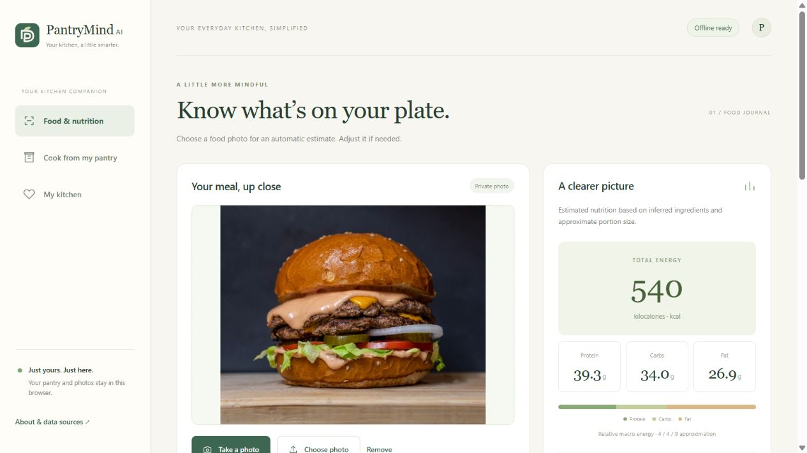

# PantryMind AI

**Your intelligent kitchen companion.** An offline-first kitchen website with private meal photos, deterministic nutrition calculations, and pantry-based recipe recommendations.

**[Open the live website](https://shihabbk18.github.io/PantryMind-AI/)** · [Validation record](VALIDATION.md) · [Data and image licenses](THIRD_PARTY_NOTICES.md)



## Features

- Select a meal photograph or use a supported mobile browser's camera picker. Photos stay on your device.
- Upload a food photo: a browser-based CLIP model predicts the probable dish on-device, maps it to likely ingredients with standard serving weights, and calculates initial calories/macros automatically. No recipe dropdown or mandatory edits. Optional edits and serving-size changes recalculate deterministically.
- Optional free-text dish correction and manual ingredient entry remain available if the guess is wrong or unsupported.
- Enter comma-separated ingredient names such as `potato, egg, onion, olive oil`. Quantities are optional. Get pictured ideas, quick steps, and calculated nutrition using standard recipe weights.
- Get up to three quantity-aware recipe matches with dietary/calorie preferences, cooking instructions, and explicit shortages.
- Save favorites and pantry items locally. My Food Diary groups meals into breakfast, lunch, dinner and snacks, with editable dates, daily calorie/macro totals and deletion. Add missing recipe ingredients to a persistent grocery checklist.
- Use core features offline after the first successful visit: the service worker caches application files, recipes, catalog, and photographs.

**Recognition assumptions:** a pinned, free [CLIP ViT-B/32 model](https://huggingface.co/Xenova/clip-vit-base-patch32) runs in a Web Worker using Transformers.js and WASM. First use downloads approximately **154 MB** of q8 text/vision weights from Hugging Face; photos never leave the device and no hosted inference/API key is used. It compares the photo against **46 food descriptions and 8 non-food descriptions**, including biryani, khichuri, dal, curries and mixed plates. Top plausible matches are shown. Weak or nearly tied scores show Unknown Food; likely non-food images receive no automatic nutrition. These checks are heuristic, not calibrated confidence or a general accuracy guarantee.

The leading sufficiently distinct food match selects one of **48 documented serving templates**. Ingredient weights, oils, sauces and composition are authored assumptions, never image measurements. Small/Medium/Large changes scale those assumptions. A mixed-meal template does not segment or identify every component. Search for a dish or edit ingredients when recognition is wrong or unavailable. All nutrition is computed from USDA records. **14 bundled licensed photographs** are illustrative serving suggestions, not newly AI-generated images or exact photographs of every recipe.

## Try it

1. Open the live website and wait for **Offline ready** before using it without connectivity.
2. Choose a burger/pizza/food photo and wait for automatic recognition and initial nutrition. Optional edits correct the assumed ingredients and serving size. For a deterministic arithmetic check, manually enter **Rice, cooked, 200 g**: **260 kcal, 5.38 g protein, 56.34 g carbs, 0.56 g fat** before rounding.
3. Give the meal a name, select Breakfast/Lunch/Dinner/Snacks and a date, and save it to Food Diary. Use My Kitchen to see daily totals, edit or delete entries.
4. Type `potato, egg, onion, olive oil` and select **What can I cook?** directly. You do not need to supply grams or separately save the names. Open a recipe for full instructions and missing ingredients.
5. Save a favorite recipe, or choose **Add missing ingredients**. My Kitchen includes your Food Diary and grocery checklist. Records survive reloads in the same browser and origin.

Supporting browsers can install the site as a PWA or add it to the home screen. This release is a website, not a native Android APK. Camera selection depends on browser/device support; gallery selection remains available.

## Local development

Requires Node.js 20+ for tests and Python 3 for the example static server. The website has no package dependencies, backend, API keys, or hosted inference.

```sh
node scripts/build-web.mjs
node --test tests/*.test.mjs
python -m http.server 8010 --bind 127.0.0.1 --directory web
```

Open `http://127.0.0.1:8010/`. Serve files over HTTP rather than opening index.html directly. Service workers require HTTPS or localhost.

## Nutrition and provenance

The catalog contains **50 common ingredients** extracted from USDA FoodData Central **SR Legacy April 2018** CSVs. Each record preserves its FDC ID, exact source description, and energy/macronutrients per 100 g. Raw and cooked forms are distinct.

For each nutrient, sum `ingredient grams / 100 × value per 100 g`. Recipe totals are divided by declared servings. Energy uses USDA values directly; the chart uses approximate 4/4/9 macro energy factors, which can differ from reported calories.

Unknown foods, missing weights in manual nutrition entry, invalid quantities, and incomplete catalog records block calculation. Photo estimates explicitly assume standard oil/sauce amounts where listed; hidden ingredients can still be missed. Portion templates distinguish raw ingredient-equivalent and cooked weights, and disclose nutrient proxies and omissions. Egg pieces approximate 50 g edible mass each; weighing improves accuracy. Brands and preparations vary, so meal results remain estimates.

[USDA documentation](https://fdc.nal.usda.gov/data-documentation/) · [Source archive](https://fdc.nal.usda.gov/fdc-datasets/FoodData_Central_sr_legacy_food_csv_2018-04.zip)

Reproduce the catalog by downloading the archive and running:

```sh
python scripts/import_nutrition.py /path/to/FoodData_Central_sr_legacy_food_csv_2018-04.zip assets/data/nutrition.json
node scripts/build-web.mjs
```

The importer matches exact source descriptions and rejects missing nutrient values. The catalog records the archive SHA-256.

## Recommendation method

The 40 authored recipe templates have explicit weights, servings, times, and instructions. For names-only entries, presence counts as ingredient availability, with quantities explicitly unknown. Raw chicken, dry rice, and dry pasta may be cooked for the corresponding recipe; no mass conversion is inferred. For optional measured stock, ingredient coverage is `min(available grams / required grams, 1)`. The score is the mean coverage across distinct ingredients; duplicate amounts are aggregated. Recipes with zero overlap are excluded.

First sort by coverage descending, shortage count ascending, preparation time ascending, then stable ID. Select three varied recommendations greedily: penalize up to 0.22 for ingredient-set Jaccard similarity to a previously selected dish, plus 0.08 for a repeated recipe family. These are disclosed UX heuristics, not learned parameters or claims of optimality. Calorie preferences filter calculated per-serving energy. Each suggestion independently uses the pantry; suggestions do not jointly reserve inventory. Partial matches include a shopping list and do not imply everything is available. Dietary tags are recipe metadata, not allergy guarantees.

## Privacy and storage

IndexedDB version 2 preserves version 1 pantry, favorites and meals and adds groceries; photos are resized locally before saving. Personal records and photos are not sent to a backend. GitHub Pages receives ordinary requests for public files on the initial visit. There are no accounts, cloud backup, synchronization, or analytics integrations. Clearing site data, storage eviction, private browsing expiration, or changing browsers can remove/separate records. Unsaved meal edits are session-only. Diary totals use the selected local calendar date; legacy entries use their creation date and default to Snacks when edited. Grocery amounts aggregate shortages across selected recipes, with one contribution per recipe so repeated clicks do not inflate them. Checking a grocery item does not silently change pantry stock.

## Structure and deployment

```text
web/                 Static website, calculation/ranking engine, IndexedDB, PWA
web/data/            Catalog, recipes, photograph credits
web/images/          Bundled licensed serving photographs
assets/data/         Source catalog with USDA provenance
scripts/             Catalog importer, photograph downloader, web preparation
tests/               Node test suite
.github/workflows/   Tests followed by GitHub Pages deployment
```

The proposed Android/backend architecture was replaced by a static website at the user's request. Nutrition runs deterministically in JavaScript, requiring no Python hosting or internet connection for core use.

GitHub Actions tests and publishes web/ on pushes to main. Set Pages build source to **GitHub Actions**. Relative paths support repository-path hosting. Bump the cache version in web/sw.js when changing cached files. Cache installation requests fresh files to avoid stale catalogs; reload after an update finishes. The production preparation script validates all recipe ingredients, serving templates, pictures and offline assets before deployment.

See [VALIDATION.md](VALIDATION.md) for executed tests and remaining checks. No project-level classifier accuracy, portion measurement accuracy, AI performance improvement, native APK, or physical-device camera verification is claimed. First recognition needs internet; cached weights can be evicted. Manual nutrition and pantry features remain usable without the model. CPU inference can take tens of seconds on slower devices.

Code and original recipes: MIT. Photographs retain the Unsplash license; see [THIRD_PARTY_NOTICES.md](THIRD_PARTY_NOTICES.md).
